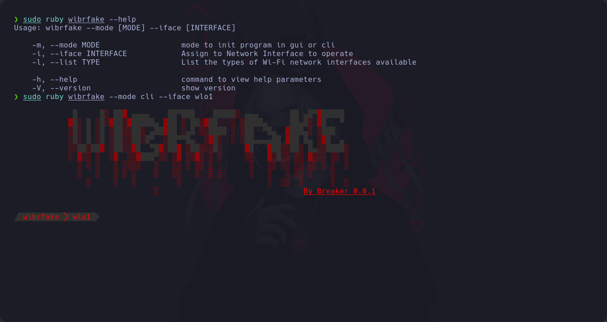
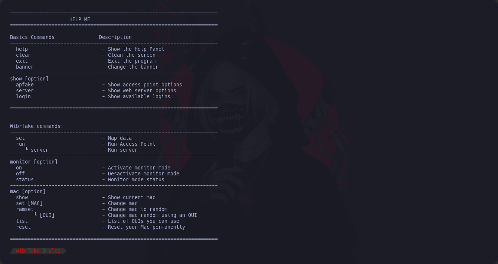

# WirFake

[`WibrFake.com`](https://github.com/BreakerTWS/WibrFake.git)

This script was made by [`Breaker`](https://github.com/BreakerTWS)

Wibrfake is an advanced cybersecurity tool developed for the creation of fake access points with captive portals with the aim of exploring and understanding vulnerabilities of Wi-Fi networks.

# GitHub Stats

<h1> Installation</h1>

<h3> Bundle</h3>

> $ **bundle install**

<h2>Setup</h2>

> $ **sudo ruby wibrfake --mode cli --interface [YOURINTERFACE]**

<h2>WibrFake Help</h2>

---
# Version
## CoBreak

# License

This project is licensed under the (GNU GENERAL PUBLIC LICENSE) - see the [LICENSE](LICENSE) file for details
# CoBreak
